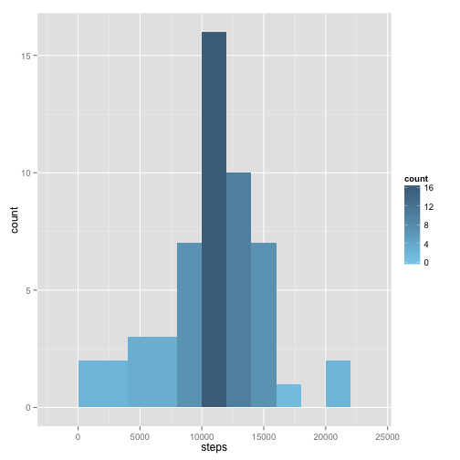
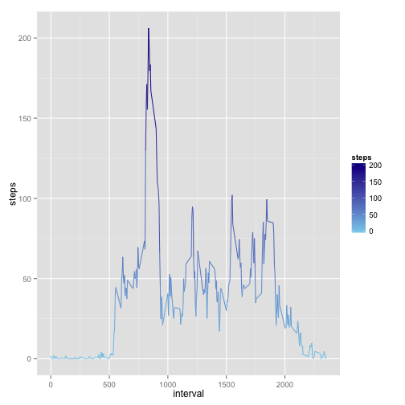
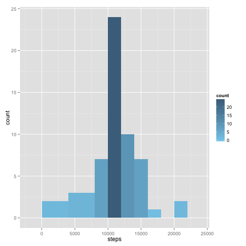
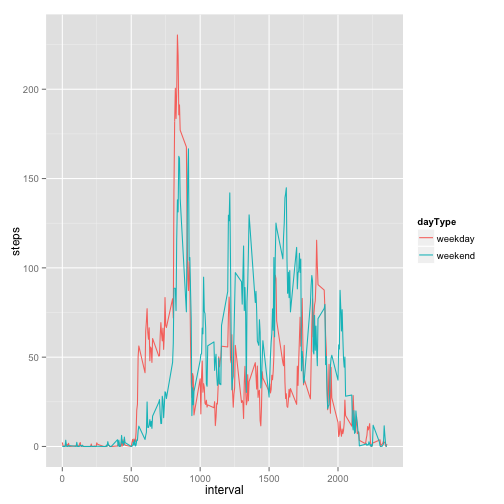

Required libraries: `ggplot2, dplyr`

### Loading and preprocessing the data

Loading `activity` data:


```r
options(scipen=100, digits=1)
suppressMessages(library(ggplot2))
suppressMessages(library(dplyr))
activity <- read.csv("../data/activity.csv", stringsAsFactors = FALSE)
```


### What is mean total number of steps taken per day?

First lets remove `NA` values and group data by `date` summing number of `steps`:

```r
activityNoNA <- filter(activity, !is.na(steps))
sumByDay <- summarise(group_by(activityNoNA, date), steps = sum(steps))
head(sumByDay)
```

```
## Source: local data frame [6 x 2]
## 
##         date steps
## 1 2012-10-02   126
## 2 2012-10-03 11352
## 3 2012-10-04 12116
## 4 2012-10-05 13294
## 5 2012-10-06 15420
## 6 2012-10-07 11015
```

Now lets plot histogram:

```r
ggplot(sumByDay) + geom_histogram(aes(steps, fill=..count..), binwidth = 2000) + scale_fill_gradient(low="skyblue", high = "skyblue4")
```

 

Average steps per day:

```r
mean(sumByDay$steps) #sum(activity$steps, na.rm =TRUE)/length(unique(activity$date))
```

```
## [1] 10766
```
Median:

```r
median(sumByDay$steps)
```

```
## [1] 10765
```


### What is the average daily activity pattern?

Grouping data by `interval` and taking `mean`:

```r
avgByInterval <- summarise(group_by(activityNoNA, interval), steps = mean(steps))
head(avgByInterval)
```

```
## Source: local data frame [6 x 2]
## 
##   interval steps
## 1        0  1.72
## 2        5  0.34
## 3       10  0.13
## 4       15  0.15
## 5       20  0.08
## 6       25  2.09
```

Time series plot of the average number of steps taken:

```r
ggplot(avgByInterval) + geom_line(aes(x = interval, y = steps, colour=steps)) + scale_colour_gradient(low="skyblue", high = "darkblue")
```

 

The 5-minute interval that, on average, contains the maximum number of steps:

```r
max(avgByInterval$steps)
```

```
## [1] 206
```


### Imputing missing values

Total number of missing values:

```r
sum(is.na(activity$steps))
```

```
## [1] 2304
```

Filling missing interval data with average for that interval across all days:


```r
#Joining average value for every interval
activityFilled <- merge(activity, avgByInterval, by = c("interval"))
#Ordering by date and interval
activityFilled <- arrange(activityFilled, date, interval)
#Filling empty values
activityFilled$steps <- ifelse(is.na(activityFilled$steps.x), activityFilled$steps.y, activityFilled$steps.x)
activityFilled <- select(activityFilled, -steps.x, -steps.y)
```

### Imputing missing values

Histogram of average steps per day after filling `NA` values:

```r
sumByDayFilled <- summarise(group_by(activityFilled, date), steps = sum(steps))
ggplot(sumByDayFilled) + geom_histogram(aes(steps, fill=..count..), binwidth = 2000) + scale_fill_gradient(low="skyblue", high = "skyblue4")
```

 

Mean after filling values:

```r
mean(sumByDayFilled$steps)
```

```
## [1] 10766
```

Median after filling values:

```r
median(sumByDayFilled$steps)
```

```
## [1] 10766
```

### Are there differences in activity patterns between weekdays and weekends?

Defining day of week and type of day for every interval:

```r
activityFilled$day <- weekdays(as.Date(activityFilled$date))
activityFilled$dayType <- as.factor(ifelse(activityFilled$day %in% c("Sunday","Saturday"), "weekend","weekday"))
head(activityFilled)
```

```
##   interval       date steps    day dayType
## 1        0 2012-10-01  1.72 Monday weekday
## 2        5 2012-10-01  0.34 Monday weekday
## 3       10 2012-10-01  0.13 Monday weekday
## 4       15 2012-10-01  0.15 Monday weekday
## 5       20 2012-10-01  0.08 Monday weekday
## 6       25 2012-10-01  2.09 Monday weekday
```

Gouping by `interval` and `dayType`:

```r
avgByIntervalFilled <- summarise(group_by(activityFilled, interval, dayType), steps = mean(steps))
head(avgByIntervalFilled)
```

```
## Source: local data frame [6 x 3]
## Groups: interval
## 
##   interval dayType steps
## 1        0 weekday  2.25
## 2        0 weekend  0.21
## 3        5 weekday  0.45
## 4        5 weekend  0.04
## 5       10 weekday  0.17
## 6       10 weekend  0.02
```

Plotting graph to compare weekends and weekdays(to make it two-paneled you just need to uncomment end of line, personally I like both lines on the same plot):

```r
ggplot(avgByIntervalFilled) + geom_line(aes(x = interval, y = steps, group=dayType, colour=dayType)) # + facet_grid(dayType~.)
```

 

Looks like guy is very active in the mornings =)
